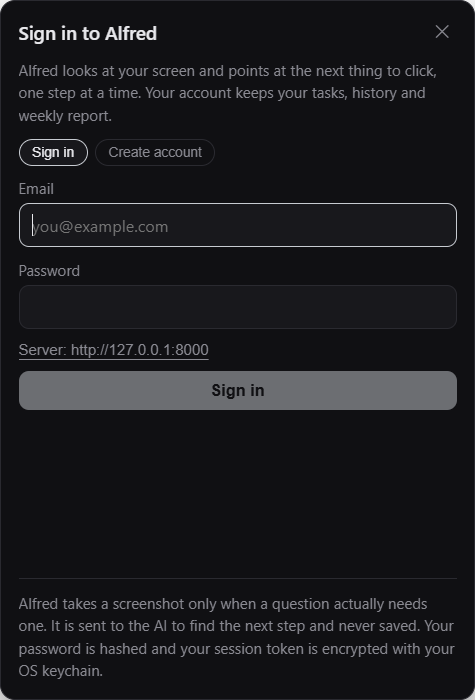
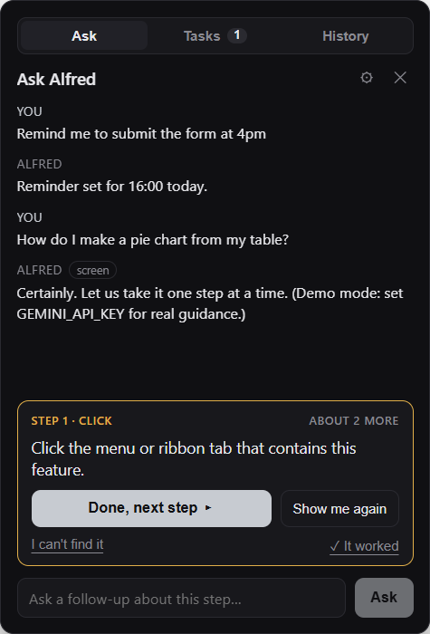
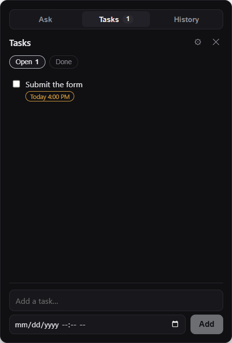
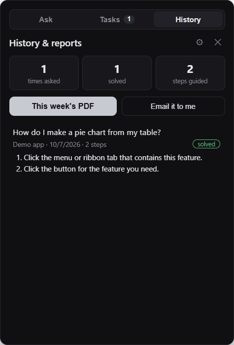

# Alfred

A small floating butler that lives in the corner of your screen. When you get stuck in an app you don't know,
press **Ctrl/Cmd + Shift + A**, say what you're trying to do, and Alfred **points at the next thing to click**,
one step at a time, until you're done. He also keeps your to-dos and reminders.

| Sign in | A guided step | The pointer | Tasks | History & reports |
| --- | --- | --- | --- | --- |
|  |  |  |  |  |

## What it does

- **Ask:** "How do I make a pie chart from this table?" Alfred takes one screenshot, works out where you are,
  and draws a gold ghost cursor that glides to the right button and rings it, with the instruction beside it.
  Press **Done, next step** and he takes a fresh look and points at the next one. **I can't find it** explains
  the same step again. On Windows he can also glide your real mouse pointer there. He never clicks for you.
- **Tasks:** to-dos and reminders. Add them in the panel, or just say *"remind me to submit the form at 4pm"*.
  When a reminder comes due you get a native notification, or an email if Alfred wasn't running.
- **History & reports:** every task Alfred walked you through is saved with its steps. Each Monday morning you
  get a PDF "cheat sheet" of your week by email, so next time you can do it alone.

## How a question is answered

```
 ┌──────────── Desktop (Electron + React) ─────────────┐         ┌────────────────── Backend (FastAPI) ───────────────────┐
 │ Floating icon, tray, Ctrl+Shift+A                   │         │ /auth      accounts, PBKDF2 hashes, JWT                │
 │ Ask box ─────────── message + recent turns ─────────┼───────► │ /chat      Gemini tool loop: create/update/complete/   │
 │                                                     │ ◄───────┼────────── delete tasks, or look_at_screen(goal)        │
 │ look_at_screen? → one screenshot ── goal + image ───┼───────► │ /sessions  Gemini vision → ONE step + bounding box     │
 │ Overlay: ghost cursor + ring  ◄──── step + box_2d ──┼─────────│            cache first (perceptual hash of the screen) │
 │ "Done, next step" → fresh screenshot → repeat       │         │ /tasks     to-dos and reminders per user               │
 │ Reminder sweep every 30 s → OS notification         │         │ /reports   weekly PDF, email                           │
 └─────────────────────────────────────────────────────┘         │ APScheduler: weekly report, missed-reminder email,     │
                                                                 │ cache purge, stale-session cleanup                     │
                                                                 │ SQLite: users, tasks, sessions, steps, messages, cache │
                                                                 └────────────────────────────────────────────────────────┘
```

Every message goes to `/chat`, where Gemini gets five tools — `look_at_screen`, `create_task`, `update_task`,
`complete_task`, `delete_task` — and picks. Task tools run on the server against the database. `look_at_screen`
ends the loop and hands back to the desktop, which then takes the screenshot.

That design decides the privacy model for free. **No screenshot is taken up front.** "Add buy milk to my list"
never touches the screen at all.

When a screenshot is needed, Alfred's own windows are made invisible for that instant so the model sees your app
and not Alfred. The vision model is asked for exactly **one** next step and the bounding box of the element to
click, normalised to 0–1000 so it maps onto any screen size or DPI. Asking for one step at a time, on a fresh
screenshot each time, is what lets Alfred keep up when a menu opens or a dialog pops up.

The current task list goes into the system prompt on every turn rather than sitting behind a `list_tasks` tool.
It's small, it's what most task questions are about, and having the ids up front means *"mark the dentist one
done"* resolves in a single round trip.

## What Alfred does not do

- **No continuous or background screen capture.** A screenshot happens only when a question needs one, or when
  you press *Done, next step*. Never on a timer, never while idle.
- **No screenshots on disk, ever.** The image is downscaled, sent to the model, and dropped. The server keeps only
  a 64-character perceptual hash, used as a cache key.
- **No clicking for you.** Alfred points; you click. That's how you learn, and it can't click the wrong thing.
- **No paid APIs.** Gemini's free tier (no credit card), SQLite, and Gmail SMTP are all free.

## Program concepts (FlyRank capstone: 7 of 7)

| Concept | Where |
| --- | --- |
| API endpoints | `backend/app/main.py`: 22 REST routes, OpenAPI docs at `/docs`, every error as `{"error": ...}` |
| Database | `backend/app/db.py`: SQLite, 8 tables (users, tasks, help_sessions, steps, messages, llm_cache, reports, job_runs) |
| Authentication | `backend/app/auth.py`: sign-up/login, PBKDF2-SHA256, HS256 JWT bearer tokens, per-user isolation. Desktop keeps the token encrypted with the OS keychain (`src/electron/store.ts`) |
| Background / cron jobs | `backend/app/jobs.py`: weekly reports (cron, Mon 08:00), missed-reminder emails (5 min), cache purge (hourly), stale-session cleanup (30 min). FastAPI `BackgroundTasks` for "email me my report". Desktop reminder sweep (`src/electron/reminders.ts`) |
| Reporting (PDF + email) | `backend/app/reports.py`: weekly PDF with totals, apps, a step-by-step cheat sheet and open to-dos, sent over SMTP |
| Caching | `backend/app/cache.py`: in-memory LRU in front of a SQLite table with TTL. Key = perceptual hash of the screen + goal + progress, so the same question on the same screen is instant |
| LLM integration | `backend/app/agent.py` (Gemini function-calling loop) and `backend/app/llm.py` (vision grounding with JSON output, validation, model fallback, offline mock) |

## Setup

You need Python 3.11+ and Node 20+.

### 1. Backend

```bash
cd backend
python -m venv .venv
.venv\Scripts\activate          # macOS/Linux: source .venv/bin/activate
pip install -r requirements.txt
copy .env.example .env          # macOS/Linux: cp .env.example .env
python run.py
```

Put a free Gemini key from <https://aistudio.google.com/apikey> in `backend/.env` as `GEMINI_API_KEY`, and set
`SECRET_KEY` to a long random string. Without a key the server runs in **demo mode**: a rule-based chat and a
fixed three-step script, so you can try the whole flow offline. Email is optional (see `.env.example`).

API docs: <http://127.0.0.1:8000/docs>

### 2. Desktop app

```bash
npm install
npm start
```

Click the floating icon (or press **Ctrl/Cmd + Shift + A**) and create an account. The server URL defaults to
`http://127.0.0.1:8000` and can be changed on the sign-in screen or in Settings.

`npm start` compiles the main process before launching Electron. That step is not optional: the preload
scripts run in their own sandboxed context, outside the TypeScript loader that handles `main.ts` in dev, so they
have to exist as real JavaScript in `dist/` before the window opens.

> If Electron exits immediately or behaves like plain Node, check that `ELECTRON_RUN_AS_NODE` isn't set in your
> shell (VS Code's terminal sets it). It forces the Electron binary into Node mode and the app will never start.

## Using it

1. Click the floating icon, or press **Ctrl/Cmd + Shift + A** from anywhere.
2. **Ask** where you're stuck. Follow the gold pointer, then press **Done, next step**. Type a follow-up any time
   ("I don't see that button") and Alfred answers about the same step.
3. **Tasks** lists everything open, with overdue reminders flagged. Tick to complete, or use the clock button.
4. **History** shows past sessions with their steps, this week's PDF, and *Email it to me*.
5. Press Escape, or click away, to collapse back to the icon. While a step is on screen the panel stays open and
   moves out of the way if it would cover the target.

## Tests

```bash
npm test                    # 41 unit tests: tasks, reminders, formatting, geometry, guided-step mapping
npm run typecheck && npm run lint
cd backend && python -m pytest -q   # 30 API tests: auth, tasks, chat tool loop, sessions, cache, PDF, jobs
npm run selftest            # end-to-end: drives the real panel against a running backend, saves screenshots
```

## API

| Method | Route | Purpose |
| --- | --- | --- |
| GET | `/health` | Status and active LLM provider |
| POST | `/auth/signup`, `/auth/login` | Create account / log in, returns a JWT |
| GET, PATCH | `/auth/me` | Profile and weekly-report opt-in |
| POST | `/chat` | The Ask box: runs task tools, or returns `look_at_screen` |
| POST | `/sessions` | Goal + screenshot → step 1 |
| POST | `/sessions/{id}/next` | New screenshot (+ optional follow-up) → next step |
| GET | `/sessions`, `/sessions/{id}` | History, steps and conversation |
| PATCH, DELETE | `/sessions/{id}` | Mark solved/abandoned, delete |
| GET, POST | `/tasks` | List / create to-dos |
| PATCH, DELETE | `/tasks/{id}` | Edit, complete, re-time, mark reminded / delete |
| POST | `/tasks/clear-completed` | Remove finished to-dos |
| GET | `/stats` | Totals and top apps |
| GET | `/reports/weekly.pdf` | This week's PDF |
| POST | `/reports/email` | Build and email the PDF in the background |
| GET | `/jobs` | Job schedule, recent runs, cache stats |
| POST | `/jobs/{name}/run` | Run a job now (admins in `ADMIN_EMAILS`) |

## Stack

- **Desktop:** Electron, React + TypeScript, Vite. One frameless always-on-top panel, a click-through overlay
  window for the pointer, a tray icon. `electron-store` for preferences, `safeStorage` (Keychain / DPAPI) for the
  session token.
- **Backend:** FastAPI, SQLite, APScheduler, fpdf2, Pillow, PyJWT.
- **AI:** Google Gemini (free tier) for both the chat tool loop and screenshot grounding.

The renderer never talks to the network: it reaches the main process over `contextBridge`/IPC, and the main
process calls the backend, so the session token never reaches the page.
